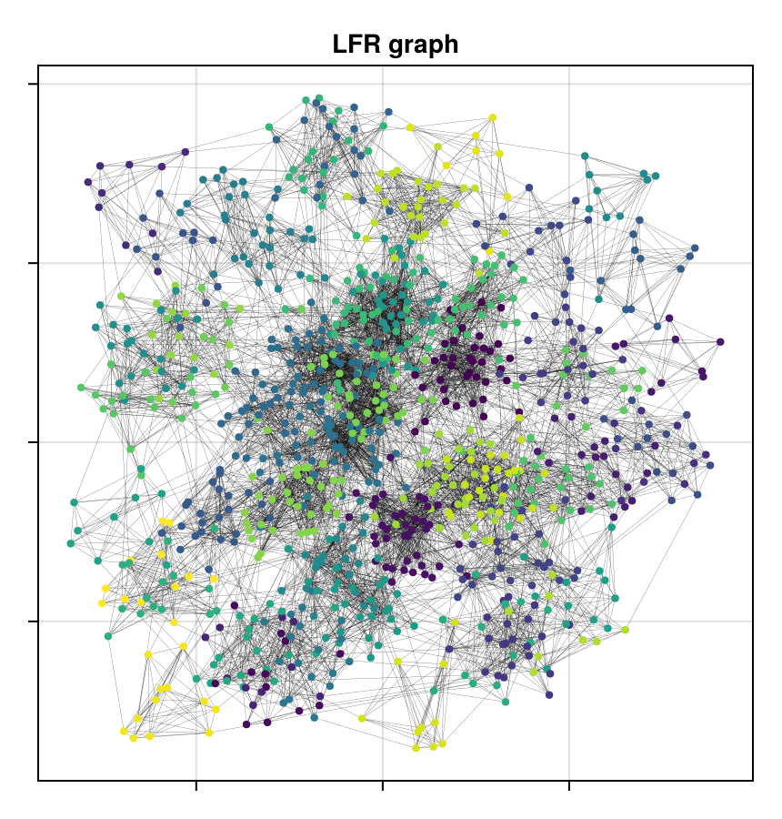

# LFRBenchmarkGraphs

[](https://fcdimitr.github.io/LFRBenchmarkGraphs.jl/stable/)
[](https://fcdimitr.github.io/LFRBenchmarkGraphs.jl/dev/)
[](https://github.com/fcdimitr/LFRBenchmarkGraphs.jl/actions/workflows/CI.yml?query=branch%3Amain)
[](https://codecov.io/gh/fcdimitr/LFRBenchmarkGraphs.jl)
[](https://github.com/JuliaTesting/Aqua.jl)

## Overview

This is a package for generating [Lancichinetti-Fortunato-Radicchi
model](https://en.wikipedia.org/wiki/Lancichinetti-Fortunato-Radicchi_benchmark) benchmarks graphs,
which are widely used in the study of community detection algorithms.

## Installation

Installation is straightforward. First, enter Pkg mode by hitting `]`, and then run the following command:

```julia-repl
pkg> add LFRBenchmarkGraphs
```

## Example usage

### Dependencies for this demo
Import the necessary packages.

````julia
using GraphMakie, CairoMakie, LFRBenchmarkGraphs, Graphs
````

### Graph generation

Generate an example LFR graph using the LFR benchmark. The LFR benchmark is a popular benchmark
for community detection algorithms. It generates graphs with a power-law degree distribution and a
community structure.

````julia
g,cid = lancichinetti_fortunato_radicchi(1000, 15, 40);
````

### Visualize graph

We use the `GraphMakie` package to visualize the graph, with the default layout algorithm.

````julia
f = Figure()
ax = Axis(f[1, 1], title = "LFR graph", xticklabelsvisible = false, yticklabelsvisible = false)
graphplot!(ax, g; edge_width = 0.1, node_color = cid, node_size = 6)
colsize!(f.layout, 1, Aspect(1, 1.0))
resize_to_layout!(f)
f
````

